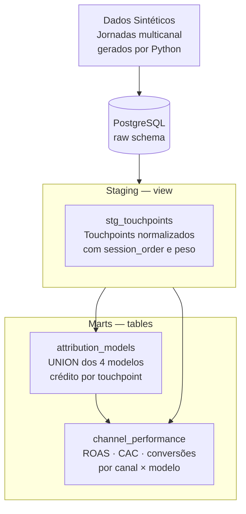

# 📣 Marketing Attribution — dbt + PostgreSQL


> **Analytics Engineering project:** Implementação dos 4 modelos de atribuição de marketing (Last Touch, First Touch, Linear e Time Decay) em dbt SQL puro — calculando ROAS e CAC por canal para cada modelo, sobre dados sintéticos de jornadas multicanal.

---

## 🏗️ Arquitetura dbt



---

## 💡 Problema de Negócio

Times de marketing enfrentam o dilema: qual canal realmente gerou a conversão? Dependendo do modelo escolhido, Google Ads ou Facebook pode parecer o melhor canal. Este projeto calcula os 4 modelos canônicos em SQL, permitindo ao time comparar resultados e tomar decisões de budget mais inteligentes.

---

## 📦 Modelos dbt

| Modelo | Camada | Tipo | Descrição |
|---|---|---|---|
| `stg_touchpoints` | Staging | View | Touchpoints com `session_order`, canal, valor e flag de conversão |
| `attribution_models` | Mart | Table | Crédito por touchpoint nos 4 modelos via UNION |
| `channel_performance` | Mart | Table | ROAS, CAC e conversões por canal × modelo de atribuição |

---

## 🔑 Destaques Técnicos

- **4 modelos em SQL puro** — sem bibliotecas externas:
  - **Last Touch**: `CASE WHEN ROW_NUMBER() DESC = 1` — 100% ao último toque
  - **First Touch**: `CASE WHEN ROW_NUMBER() ASC = 1` — 100% ao primeiro toque
  - **Linear**: `1.0 / total_touchpoints` — divisão igualitária
  - **Time Decay**: `EXP(-decay_factor * days_before_conversion)` normalizado — maior peso a toques mais recentes
- **UNION pattern**: todos os 4 modelos combinados em `attribution_models` com coluna `model_name` — facilita filtragem no BI
- **ROAS calculado**: `SUM(revenue_attributed) / SUM(ad_spend)` por canal e modelo
- **CAC calculado**: `SUM(ad_spend) / COUNT(DISTINCT converted_customer_id)`

---

## 📊 Comparação de Modelos — channel_performance (amostra)

| channel | model | attributed_revenue | roas | cac |
|---|---|---|---|---|
| google_ads | last_touch | 48.200 | 4.2x | R$ 24 |
| google_ads | first_touch | 21.000 | 1.8x | R$ 55 |
| facebook | last_touch | 12.000 | 1.5x | R$ 68 |
| facebook | linear | 28.500 | 3.6x | R$ 28 |

*Notar como a escolha do modelo muda radicalmente a percepção de qual canal performa melhor.*

---

## 🚀 Como Executar

```bash
# 1. Clone o repositório
git clone https://github.com/santosalmeida1708/marketing-attribution-dbt.git
cd marketing-attribution-dbt

# 2. Suba o banco (porta 5435)
docker compose up -d

# 3. Gere os dados sintéticos
pip install -r requirements.txt
python scripts/generate_marketing_data.py

# 4. Execute o projeto dbt
dbt deps && dbt run && dbt test

# 5. Documentação
dbt docs generate && dbt docs serve
```

---

## 🎯 Skills Demonstradas

`dbt` · `SQL avançado` · `PostgreSQL` · `Marketing Attribution` · `Time Decay (EXP)` · `Window Functions` · `ROAS/CAC` · `Data Modeling` · `Docker` · `Python`

---

## 📈 Próximas Evoluções

- [ ] Modelo de atribuição Shapley Value (game theory)
- [ ] Dashboard comparativo de modelos no Metabase
- [ ] Integração com dados reais do Google Ads API
